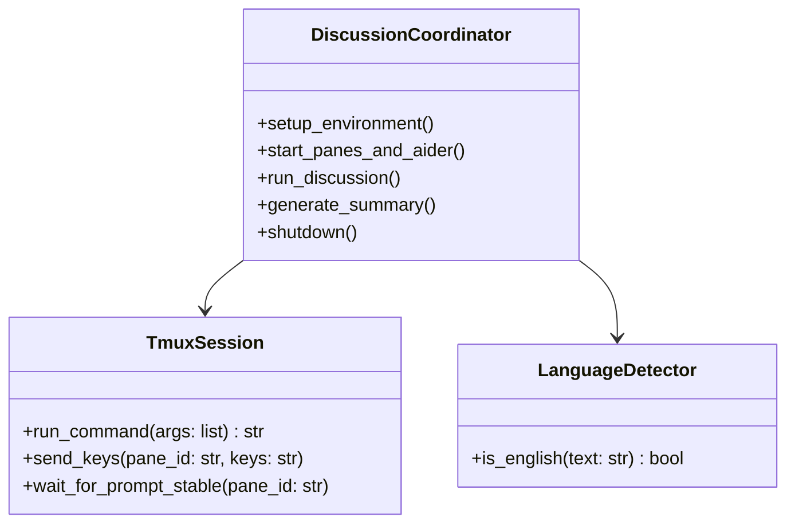

# アーキテクチャ憲章 (ARCHITECTURE_MANIFEST.md)

---

## Part 1: このマニフェストの取扱説明書 (Guide)

### 1. 目的 (Purpose)
本ドキュメントは、ThrumTerm プロジェクト全体の動作アーキテクチャ、設計意図、および開発者（人間）とAIが共有すべき「憲法」を定義するルート・マニフェストです。
コードの変更や機能追加は、常に本マニフェストの記述を唯一の「正」として適合させ、設計崩壊を未然に防ぐことを目的とします。

### 2. 憲章の書き方 (Guidelines)
- **原則1: 具体的に記述する。** 抽象的な表現（「高速化する」等）を避け、動作境界や具体的なAPIシグネチャを定義します。
- **原則2: 「なぜ」に焦点を当てる。** 決定の背後にあるトレードオフ（例: 状態安定性のために同期的ポーリングを採用する等）を記述します。
- **原則3: 「判断の背景」を記述する。** 単なる禁止ルールの羅列ではなく、設計思想の文脈を明記します。

### 3. リスクと対策 (Risks and Mitigations)
- **リスク**: コードとマニフェストの乖離（陳腐化）。
  - **対策**: アーキテクチャに影響を与えるコードの変更は、マニフェストの更新が承認される前に着手してはならない（マニフェスト先行の原則）。

---

## Source Analysis Metadata

- **Source Repository**: ThrumTerm
- **Detected License**: MIT License (LICENSEファイル検出)
- **Structural Similarity Risk**: Low (CIP-Bridgeのスピンオフとして新設計された制御ツール)
- **Attribution Required**: CIP-Bridge (https://github.com/... 等) からのスピンオフである旨を明記。

---

## Part 2: マニフェスト本体 (Content)

### 1. 核となる原則 (Core Principles)
- **原則: マニフェスト先行の原則**
  - *理由*: AIエージェントが思い付きの実装でコードを破壊するのを防ぐため、すべての機能設計・API変更はコード実装前に本マニフェストを更新・承認する手順を踏むこと。
- **原則: 状態のロックによるLLMの改変防止**
  - *理由*: LLMが自身のコンテキストである設定ファイルやプロンプト指示を書き換えてしまうループを抑止するため、設定ファイルはOSレベルで読み取り専用（`chmod 444`）にロックする。
- **原則: 二重警告によるオウム返しの撲滅**
  - *理由*: LLMがコンテキスト中の相手の発言を回答（output.txt）に引き写してしまうマージバイアスを防ぐため、AGENTS.mdとプロンプト指示の双方で「コピペ・引用の厳禁」を警告する。

### 2. 主要なアーキテクチャ決定の記録 (Key Architectural Decisions)
- **2026-06-28: ファイル移動（shutil.move）によるバトン渡しの採用**
  - *Decision*: 自身の `output.txt` を相手の `input.txt` に上書き移動する。
  - *Rationale*: メタデータヘッダーの混入を完全に排し、送信元のファイルを自動的に消去することで、Aiderの差分パッチマージミスを防ぐため。
- **2026-06-29: ディレクトリ階層ごとのマニフェスト分割（フラクタル構造）の導入**
  - *Decision*: agent_configs/ および sandbox/ ディレクトリにそれぞれサブ・マニフェストを配置する。
  - *Rationale*: プロジェクトが成長した際の単一マニフェスト肥大化を避け、スコープをディレクトリドメインに限定してAIのハルシネーションを防ぐため。
- **2026-06-29: 中立AIによる外部要約と監視ペイン再利用の採用**
  - *Decision*: Aiderプロセス終了後に `tail` ペインに `Ctrl+C` を送信して停止させ、そこで Ollama API ワンライナーを中立AIとして起動して要約を `>>` 追記する。
  - *Rationale*: 討論人格による要約バイアスを完全に排除し、かつAiderのファイル更新エラーリスクをゼロにするため。

### 3. AIとの協調に関する指針 (AI Collaboration Policy)
- **未知の問題への対処**: 憲章に記述のない事象（例: tmux内の特定の表示例外等）に直面した場合、AIは独断で場当たり的修正を行わず、複数の解決策とトレードオフを人間に提示し、判断を仰ぐこと。
- **戦略と戦術の連携**: ルート・マニフェスト（戦略）で定義された原則は、ソースコード内のタグコメント（戦術：`// @intent:...`）によってすべての主要関数にマッピングされ、一貫性を保つこと。

### 4. コンポーネント設計仕様 (Component Design Specifications)

ルート・マニフェストは、以下の主要クラスの連携によって全体の討論ループをオーケストレーションします。

- **DiscussionCoordinator (主要オーケストレーター)**
  - **責務**: 全体のライフサイクル管理、tmuxの3ペイン（LeaderAI / WorkerAI / tailペイン）の起動、指定されたラリー数に基づく討論の同期実行、および独立した中立AIによる討論要約の実行。
  - **提供する主要API**:
    - `setup_environment()`: ログファイル (`discussion_log.md`) の初期化、設定ディレクトリ (`agent_configs/`) の自動生成、および `sandbox/` ディレクトリの完全な初期化。
    - `start_panes_and_aider()`: 擬似端末ペインを起動し、エージェントごとに `--read AGENTS.md` オプションを明示的に付与したAiderクライアントプロセスを非同期起動する。
    - `run_discussion()`: A/Bエージェント間で、空ファイル配置（`create_empty_output`）→プロンプト送信→待機（`wait_for_prompt_stable`）→応答回収→移動（`move_to_opponent_input`）のループを同期的に繰り返す。
    - `generate_summary()`: 
      1. 討論終了後、Aiderプロセス（LeaderAI / WorkerAI）に `/exit` を送って安全に終了させる。
      2. `tail` でログ監視を行っていた第3ペイン (`pane_tail`) に対し `Ctrl+C` を送信してログ監視を終了させる。
      3. `pane_tail` で、指定された Ollama API を叩く Python ワンライナーを中立AI（ペルソナなし）として実行し、生成された要約を `discussion_log.md` へリダイレクト追記（`>>`）する。

- **TmuxSession (端末操作アダプター)**
  - **責務**: `tmux` プログラムのシステムプロセス呼び出しをカプセル化し、キー送信とペイン状態監視を行う。
  - **提供する主要API**:
    - `wait_for_prompt_stable(pane_id, timeout_seconds=300)`: 指定されたペインの画面内容をキャプチャし、末尾行が `>` （入力待ち状態）で安定するまでポーリング待機する。

- **LanguageDetector (多言語対応自動検知)**
  - **責務**: 討論テーマに日本語文字（ひらがな・カタカナ・漢字）が含まれるかを検知し、エージェントの適用言語（日・英）を判断する。

### 5. 既知の未解決課題と保留事項 (Known Open Issues & Deferred Decisions)
- **Issue: Aider接続切断時の自動再接続処理**
  - *Status*: 保留。
  - *Rationale*: プロトタイプ段階であり、接続エラー発生時は手動でtmuxセッションを閉じて再起動する方がコストが低いため。
