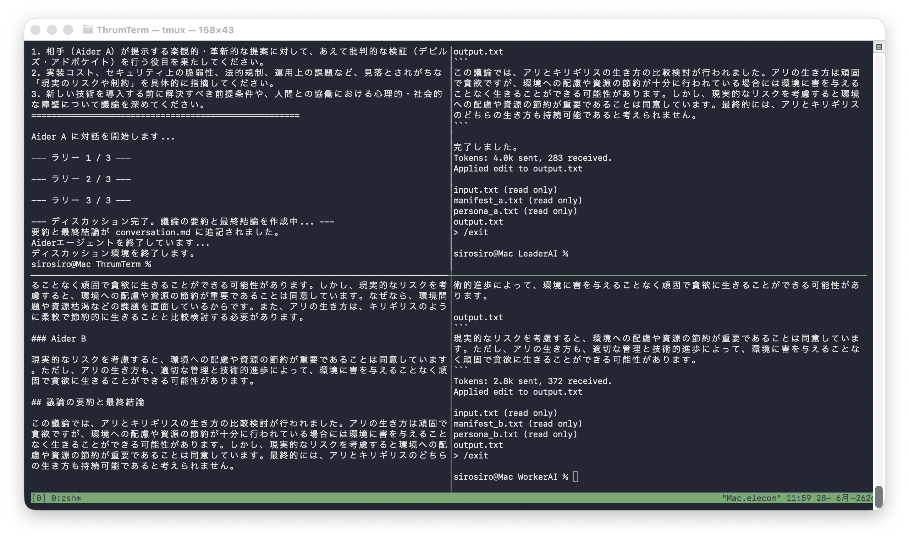
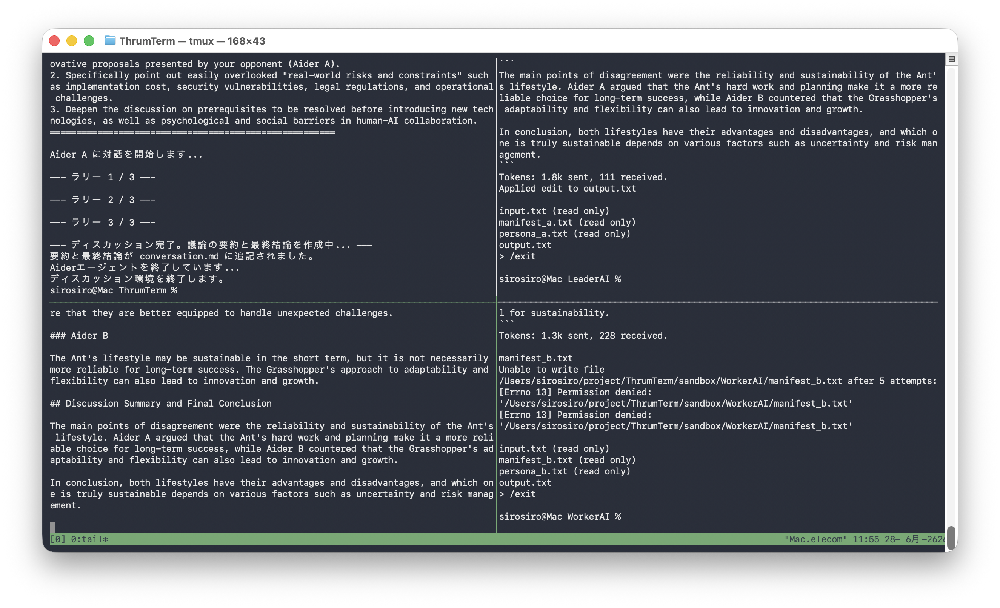

# ThrumTerm
 
> **Ad-hoc Autonomous Agent Discussion Environment via tmux, Aider, and Ollama**
 
`ThrumTerm`（スラム・ターム）は、`tmux`、`Aider`、そして`Ollama`を高度に融合させ、ローカル環境完結型で動作する自律型AIマルチエージェント・ディスカッション（合議・開発）環境です。
 
アンディ・ウィアーのSF小説『プロジェクト・ヘイル・メアリー』に登場する、エリド人の超有機的集合知システム「スラム（thrum: 鳴動）」にインスパイアされています。各エージェントはtmuxの独立したペイン（Pane）という個のニューロンでありながら、相互のコンテキストを多重化（Multiplexing）して議論を交わすことで、個体のLLMを超えた「即席の集団精神（Ad-hoc Group Mind）」をターミナル上に構築します。
 
---
 
## コア・コンセプト
 
- **有機的集合知（The Thrum）**
  複数の自律エージェントがそれぞれのペインで同時に発言し、コードや設計の妥当性を激しく議論。単一のプロンプトやモデルでは到達できない、多角的な視点からの意思決定やコード生成を自動で導きます。
- **完全ローカル・プライバシー（OSS Clean）**
  Ollamaをバックエンドに採用。一切の商用外部APIに依存せず、すべての推論・ログがローカルマシン（macOS / WSL2）内で完結するため、機密性の高いソースコードや設計資産の外部流出を完璧に防ぎ、クリーンなOSS開発プラクティスを担保します。
- **CLIファーストな職人環境**
  ターミナルマルチプレクサであるtmuxのセッション・ペイン管理機構をエージェントの配置グリッドとして流用。カスタムスクリプトによるオーケストレーションの自動化と、人間による監視・いつでも割り込める介入性（Human-in-the-loop）を高次元で両立します。
 
## 動作イメージ (Screenshots)
 
| 日本語テーマ実行時 (Japanese Theme) | 英語テーマ実行時 (English Theme) |
|:---:|:---:|
|  |  |
 
---
 
## システム構成
 
ThrumTermは、以下の強力なOSSミニマリズムスタックにより構築されています。
 
1. **tmux (舞台 / 空間管理)**
   各ペインに自律エージェントを閉じ込め、並列メッセージングとコンテキスト監視の空間提供。
2. **Aider (エージェント・コア)**
   ターゲットに対するリサーチ、設計提案、コードの実装・リファクタリングを自律的に遂行するエージェント。
3. **Ollama (ローカルLLMエンジン)**
   ネットワークから隔離された環境下で、高性能なオープン推論モデルを高速に駆動。
 
---
 
## 必要要件 (Requirements)
 
ThrumTermを実行するには、あらかじめ以下のツールがローカル環境にインストールされ、パスが通っている必要があります。
 
*   **tmux**: セッション管理およびペイン分割制御に必須です。
*   **Aider (`aider-chat`)**: コマンドラインAI開発エージェントツール。
*   **Ollama**: ローカルLLM実行エンジン。（※外部の商用APIモデルを使用する場合は不要）
*   **Python 3.x**: 制御スクリプト `bridge.py` の実行に必要です。
 
> [!IMPORTANT]
> **AIモデルに関する注意事項**
> 本リポジトリ（プロジェクトファイル群）には、推論用の**AIモデル本体は含まれていません**。
> ローカル（Ollama）で実行する際は、ご自身のマシンスペック（CPU/GPUの性能や搭載メモリ容量）に合わせて、適切なAIモデルを事前に Ollama 経由で個別にダウンロード（`ollama pull`）していただく必要があります。
> 
> *   **標準的な推奨環境 (メモリ 8GB以上)**: `llama3.1:8b` などの 8B クラスモデル（日本語能力と指示追従性のバランスが良く推奨されます）
> *   **省リソース環境 (メモリ制限・CPUのみなど)**: `llama3.2:3b` や `qwen2.5:3b` などの軽量な 3B クラスモデル
 
---
 
## クイックスタート
 
### 1. 前提条件の導入
 
各環境（macOS または WSL2/Linux）に応じて、必要なツールをインストールします。
 
#### macOS の場合 (Homebrew を利用)
 
```bash
# 1. tmux のインストール
$ brew install tmux
 
# 2. Aider のインストール
$ brew install aider     # もしくは pip install aider-chat
 
# 3. Ollama のインストールと起動 (ローカル実行時のみ)
$ brew install ollama    # もしくは公式サイトからダウンロードしてAppを起動
$ ollama serve &         # コマンドラインから起動する場合。Appを起動した場合は不要です。
 
# 4. 実行環境に合わせたAIモデルの取得 (例: llama3.1:8b)
$ ollama pull llama3.1:8b
```
 
#### WSL2 / Ubuntu (Linux) の場合
 
```bash
# 1. tmux のインストール
$ sudo apt update && sudo apt install -y tmux
 
# 2. Aider のインストール
# (pipを利用します。必要に応じて python3-pip や python3-venv を導入してください)
$ sudo apt install -y python3-pip python3-venv
$ pip install aider-chat
 
# 3. Ollama のインストールとサービス起動 (ローカル実行時のみ)
$ curl -fsSL https://ollama.com/install.sh | sh
$ sudo systemctl start ollama      # systemd対応環境の場合。もしくは ollama serve & でバックグラウンド起動
 
# 4. 実行環境に合わせたAIモデルの取得 (例: llama3.1:8b)
$ ollama pull llama3.1:8b
```
 
### 2. ディスカッションの実行
 
リポジトリ直下で `bridge.py` を実行します。引数としてディスカッションのテーマ、モデル名、および実行するラリー数（往復回数）を指定できます。
 
```bash
# デフォルト（テーマ：「おにぎりをレンジで温める是非」、モデル：llama3.1:8b、ラリー数：3）で実行
$ ./bridge.py
 
# カスタムテーマ、モデル、ラリー数（例：5往復）を指定して実行
$ ./bridge.py "日本の経済が停滞している原因を考察" ollama_chat/llama3.1:8b 5
```
 
実行すると、自動的に `tmux` の新規ウィンドウが分割され、各エージェント（技術イノベーターとシステムアナリスト）が自律的かつ交互にディスカッションを開始します。
 
指定したラリー数の対話がすべて終了すると、最後に **LeaderAI がこれまでの議論ログをすべて読み込み、客観的な要約と最終結論を作成して `conversation.md` の末尾に自動追記** させた後にプログラムを正常終了します。
 
#### (オプション) 商用外部API (OpenAI, Anthropic, Gemini 等) を利用する場合
 
ThrumTermは、ローカルLLMの代わりに OpenAI や Anthropic、Google Gemini などの商用外部APIキーを使用して、より高性能なモデルでディスカッションを実行することも可能です。
Aider が必要とする環境変数（APIキー）を設定し、対応するモデル識別子を指定して `bridge.py` を起動します。
 
**1. APIキーの設定 (環境変数のエクスポート)**
 
ご使用になりたいプロバイダーの環境変数をエクスポートしてください。
 
```bash
# OpenAI を使用する場合
$ export OPENAI_API_KEY="your-openai-api-key"
 
# Anthropic (Claude) を使用する場合
$ export ANTHROPIC_API_KEY="your-anthropic-api-key"
 
# Google Gemini を使用する場合
$ export GEMINI_API_KEY="your-gemini-api-key"
```
 
**2. 商用モデルを指定した実行**
 
モデル名の指定に `openai/`, `anthropic/`, `gemini/` 等の適切なプロバイダープレフィックスを付与して実行します。
 
```bash
# OpenAI GPT-4o で実行する場合
$ ./bridge.py "日本の経済が停滞している原因を考察" openai/gpt-4o
 
# Anthropic Claude 3.5 Sonnet で実行する場合
$ ./bridge.py "日本の経済が停滞している原因を考察" anthropic/claude-3-5-sonnet-20241022
 
# Google Gemini 1.5 Pro で実行する場合
$ ./bridge.py "日本の経済が停滞している原因を考察" gemini/gemini-1.5-pro
```
 
### 3. 結果の確認
 
議論の軌跡は、リアルタイムにリポジトリ直下の `conversation.md` に追記されていきます。
 
---
 
## ディレクトリ構成
 
- `bridge.py`: ディスカッションの進行、tmuxの制御、AIの応答回収を行うメインの Python スクリプト。
- `agent_configs/`: 各AIの設定（ペルソナ、役割マニフェスト）を格納するディレクトリ。
-   `persona_a.txt` / `manifest_a.txt`（技術イノベーター用設定）
-   `persona_b.txt` / `manifest_b.txt`（現実主義システムアナリスト用設定）
- `sandbox/`: 各AIの隔離実行環境（`LeaderAI/` および `WorkerAI/`）が作成されるディレクトリ（Git管理除外）。
- `conversation.md`: 記録されたディスカッションログ（Git管理除外）。
